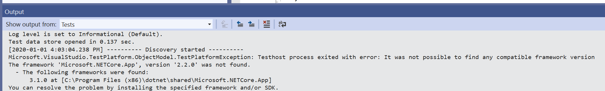
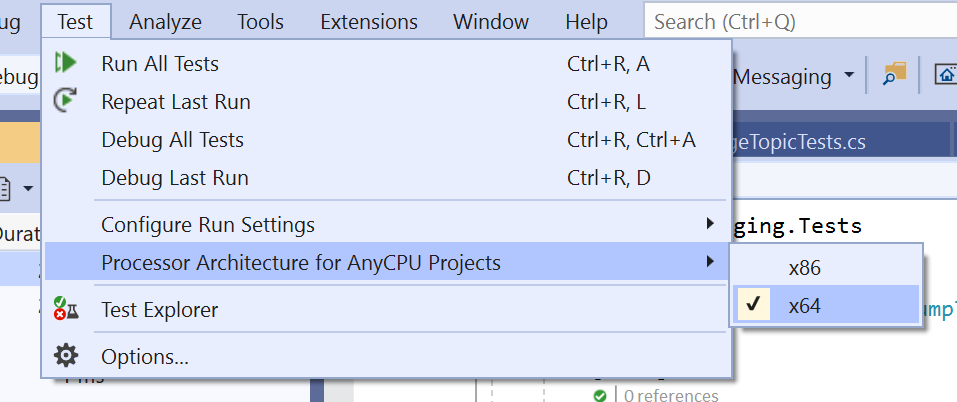

I have a new machine. So, I've been installing all the things.

I've been bringing a dotnet project up to date. First step was some tidying and making sure the tests pass. But I've been getting these...

Turns out I hadn't actually installed _all_ the things. I had installed Visual Studio 2019 (16.4) which gives you 2.1 and 3.1. But not 2.2. So off I went and installed 2.2. But only the x64 version. This was the problem... after some googling I can across this [Testhost .NET Error](https://developercommunity.visualstudio.com/content/problem/834814/testhost-net-error.html) (goto the first "Solution") and the answer is to default the test runner to x64 as follows...

